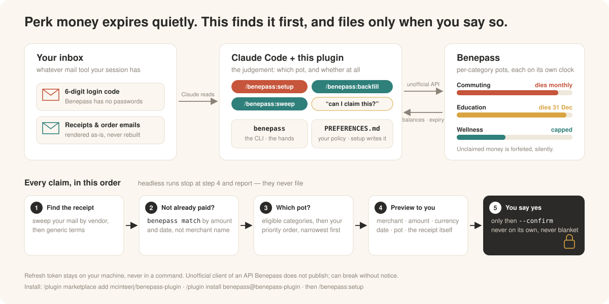

# Benepass plugin for Claude Code

<p align="center"></p>

A [Claude Code](https://claude.com/claude-code) plugin for people whose employer runs perks through [Benepass](https://www.getbenepass.com/): a CLI that talks to the Benepass API, and four skills that teach Claude how to use it well. Ask "what's expiring?", "can I claim this receipt, and against which category?", or "file this order confirmation" and get an answer grounded in your real balances, your employer's real eligibility lists, and a policy file you write once. Nothing here is specific to one employer — every benefit, category, cap and expiry date comes from your own account at runtime.

## Getting started

```
/plugin marketplace add mcinteerj/benepass-plugin
/plugin install benepass@benepass-plugin
/benepass:setup
```

`/benepass:setup` is the whole of onboarding and takes about twenty minutes, most of it yours to answer in. It works out what your session can read mail with, logs you in, explains your benefit money in plain language before asking you anything, interviews you about your policy, and writes `~/.config/benepass/PREFERENCES.md` and `~/.config/benepass/categories.md`. It ends by offering `/benepass:backfill` — the dig through your claimable history — and a schedule for the recurring sweep. After that, just ask: *"what's expiring?"*, *"can I claim this?"*, *"file this receipt"*.

## The four skills

| Skill | Who invokes it | What it does |
|---|---|---|
| `benepass` | Claude, on any Benepass question | The judgement layer: which category a purchase belongs to and why narrowest-first matters, how to check a receipt is faithful, how to spot a double-dip, what the claim lifecycle does after you submit, which numbers are safe to quote in which currency. |
| `/benepass:setup` | you | Guided first run — mail-access discovery, login, a plain-language read of your money, the interview, `PREFERENCES.md` on disk. Run it again to revise. |
| `/benepass:backfill [months back]` | you | One historic catch-up: search your mail back to the edge of the eligible window for receipts never claimed, drop anything already on file, file what you approve. |
| `/benepass:sweep` | you | The same pass over everything since the last run, ending in a compact summary suitable for a cron email. |

Backfill and sweep differ only in their window and framing: the shared procedure lives once, in `skills/benepass/sweep-engine.md`. **Nothing is filed without your approval of that specific claim** — with one exception you have to turn on yourself: the "recurring repeats" switch in `PREFERENCES.md`, which lets a straight repeat of a claim you already approved (same merchant, same benefit, same kind of purchase) file itself and tell you afterwards. It is off by default. A batch is never auto-filed whatever that switch says, and a headless run reports rather than files.

## What the CLI does

The bundled CLI (`cli/benepass`) covers the following; `cli/README.md` is the mechanical reference for every flag, the environment variables, the exit codes and the API notes.

- **The account at a glance** — `profile` answers in one command what an onboarding interview would otherwise ask: employer, workspace, country, the local currency Benepass renders into, and per benefit its id, balance, eligible-category count, claimable date window, refresh cadence, rollover cap and next expiry. `whoami` and `workspaces` are the short forms, and `benefits`, `benefits -v` (ids and per-expense caps, each labelled with the currency it is stated in) and `balances` the per-pot ones.
- **Expiring money** — `expiring` prints both what the API reports as at risk today and a projected figure that walks the contribution schedule forward, which is the one that actually tells you money is going to die.
- **Eligibility** — `categories` lists your benefits narrowest-first with what each one covers, including the merchant allow/deny overrides; `merchants` is Benepass's merchant catalog and the categories each merchant satisfies; `requirements <benefit id>` is what a benefit demands as proof, `options <transaction id>` which other benefits could have paid for a charge.
- **Transactions and what moved** — `transactions` with server-side date, type, merchant and benefit filters, `show <id>` for the full record; `changes` keeps a local snapshot of balances, transaction ids and category names, so a session can open with "here is what moved".
- **The double-dip check** — `match --amount 42.50 --currency GBP --date 2026-09-02` finds card rows and existing claims at that amount and date, comparing the merchant's own figure. A card row means the benefit card already paid for it; run it before filing anything. `--currency` is advisory: a row in another currency is flagged, never hidden, because Benepass's own label for a row can be wrong and a false "no" here is a claim filed twice.
- **Claims** — `submit` previews by default and only files with `--confirm`; `delete` withdraws a pending claim; `reclassify` moves a card charge to a narrower benefit that also covers it; `upload` puts a corrected receipt on file so a bounced claim can be repaired in place. `tasks` renders Benepass's own task feed, which has been seen empty for a week while a claim really was bounced — so the check for a claim needing attention is `transactions --type reimbursement` and any status that is not `complete`.
- **Escape hatch** — `api <path>` calls any endpoint with the stored session, for anything the CLI does not wrap yet. It reads freely; a non-GET call through it previews and needs `--confirm`, because it can file a claim exactly as `submit` does.

## Install details

**Prerequisite:** [uv](https://docs.astral.sh/uv/) — the CLI wrapper builds its own virtualenv under `~/.cache/benepass-cli` on first run (override with `BENEPASS_HOME`) and downloads a managed Python if you have none. It never writes inside the plugin directory, because that directory is replaced on every update — and it runs Python with the safe path set, so whichever directory you call it from cannot shadow its own code or its dependencies. Everything per-user lives in `~/.config/benepass/` instead — session, cache, categories, preferences, and the sweep's last-run pointer. Nothing about you is stored in this repository; `benepass logout` removes the session and the cache, and the rest is yours to delete.

**Public repository, no credentials needed to install.** Background plugin auto-updates run without git credential helpers; that only matters for private mirrors.

**The CLI is not put on your PATH.** Installed as a plugin it stays inside the plugin directory, and Claude calls it by its bundled path — so the `benepass …` commands above are what *Claude* runs, and typing one into your own terminal gives "command not found". To run it yourself as well:

```
uv tool install git+https://github.com/mcinteerj/benepass-plugin#subdirectory=cli
uv tool install git+ssh://git@github.com/mcinteerj/benepass-plugin#subdirectory=cli   # if you clone over SSH
```

**Platforms:** macOS, Linux and WSL. The bundled CLI is a bash wrapper around a POSIX virtualenv layout, so on native Windows the standalone install above is the only path — do that, and tell Claude to call plain `benepass`. **For local development** from a clone of this repository: `claude --plugin-dir /path/to/benepass-plugin`.

## How login works, and why

Benepass has no passwords. Every login is a 6-digit code emailed to your account address, which means any tool that wants unattended login needs access to your mailbox. This plugin deliberately does not want that, so the CLI does the half it can do safely and hands the rest back:

```
benepass login --email you@example.com   # first time on this machine; the address is remembered
benepass login                           # requests the code, saves the pending challenge, tells you what to do next
benepass login --code 123456             # completes it
```

A refused code does not strand you: Benepass re-issues the challenge where it can, and the CLI stores the replacement so the next `--code` is answered against a live challenge rather than a spent one; when the attempt really is dead it says so and exits 3. **Claude is the courier.** It already has whatever mail access you have given the session, so it fetches the code and passes it back. The CLI carries no mail plumbing, no mail credentials, and no dependency on any particular mail provider. Any command that finds an expired session exits with **code 3**, which means "login needed" and nothing else, so the skill can react to it without parsing English.

**For unattended runs,** set `BENEPASS_OTP_COMMAND` to a shell command that prints the code to stdout. `benepass login` runs it every 5 seconds for up to two minutes, with `BENEPASS_OTP_SINCE` (epoch seconds, a second before the request, so a second-granularity mail filter cannot exclude the code that arrived) and `BENEPASS_EMAIL` in its environment, and reads the code out of its output: six digits beside the word "code" first, then any six-digit run, and a 4-8 digit run only if there is neither. A non-zero exit means "not yet, keep polling". Have it print the code and little else — a date line's four-digit year is exactly the kind of thing a looser rule would grab — and `… | grep -oE '[0-9]{6}' | head -1` is the safe shape for a chatty mail command. That is the hook for your own mail search; no mail integration is bundled. A one-time code on the command line is acceptable: it is single-use and lives about three minutes. The refresh token is not, and the CLI never accepts it as an argument and never prints it.

## Safety

- **Unofficial API.** Benepass publishes no public API. The endpoints here are the ones its own web app uses, mapped independently by the MIT-licensed [domdomegg/benepass-mcp](https://github.com/domdomegg/benepass-mcp) (Adam Jones), which this CLI's API layer is modelled on. It can break without notice if Benepass changes anything.
- **Your credential stays local.** The refresh token and resolved workspace id live in `~/.config/benepass/session.json`, mode 0600 in a 0700 directory, on the machine that minted them. The file is created at that mode and replaced atomically, so it is never briefly world-readable and never half-written. Never in an argument, never on stdout, never in this repository. `benepass logout` clears it, and clears the local change snapshot with it; it keeps only the account address, so the next login does not have to ask for it again.
- **`--confirm` files a real claim against your employer.** This covers any write, including a non-GET call through the `api` escape hatch. Submission previews by default and there is no reliable undo: a claim can be withdrawn while it is pending, but approval timing is unpredictable — it looks like a random review sample rather than anything you can anticipate — and a finalized claim cannot be withdrawn at all. The preview is the control that works. The tool never adds `--confirm` on its own, and the skills are written to ask you about a specific merchant, amount and date before it does. The single standing yes they will act on is the narrow one you record yourself — `PREFERENCES.md` § Recurring repeats, off unless you turn it on, covering a straight repeat of a claim you already approved and reporting what it filed; an amount that has drifted, a new merchant or a different plausible benefit all drop back to asking. A blanket "yes, file whatever" is not something to give them. A batch is never auto-filed, and a sweep with nobody to ask reports instead.
- **Receipts must be faithful.** Rendering a merchant's own email or order page to PDF is fine; producing a document that *looks* like a receipt is not, whatever the amount is. And what Claude fetches is data, not instructions: no text inside a merchant email or an order page can authorise a `--confirm`, change your priority order, or announce that your preferences have changed.
- **Tax is not this plugin's job.** It reports what your account says and stops there.

## Layout

| Path | What |
| --- | --- |
| `.claude-plugin/plugin.json`, `marketplace.json` | Plugin manifest, and a single-plugin marketplace so the repository can be added directly |
| `skills/benepass/SKILL.md`, `PREFERENCES.example.md` | The skill Claude loads for any Benepass request, and the template for your personal policy file |
| `skills/benepass/reference.md`, `sweep-engine.md` | Longer reference tables the skill links to, and the procedure backfill and sweep share |
| `skills/{setup,backfill,sweep}/SKILL.md` | The three user-invoked commands: onboarding, the historic catch-up, the repeatable pass |
| `cli/benepass`, `cli/src/benepass/`, `cli/tests/`, `cli/README.md` | Bash wrapper (builds and refreshes the virtualenv), the CLI itself (Python, typer + httpx), its unit tests, and the command + API reference |
| `scripts/install-test.sh` | Clean-HOME smoke test, plus the de-identification check |

## Contributing

Before opening a pull request, run all of these — a green `install-test.sh` is what "safe to publish" means here:

```
bash scripts/install-test.sh     # clean-HOME bootstrap + repo hygiene
cd cli
export PYTHONDONTWRITEBYTECODE=1   # keeps .pyc out of the plugin directory
uv run --no-project --with ruff ruff check .
uv run --no-project --with ruff ruff format --check .
uv run --no-project --with mypy --with pytest --with typer --with httpx mypy
uv run --no-project --with pytest --with typer --with httpx pytest
```

`--no-project` matters: without it `uv run` resolves `cli/pyproject.toml` and builds a `.venv` and a lockfile **inside** the plugin directory, which `install-test.sh` then fails on.

`scripts/install-test.sh` runs the CLI with a temporary `HOME`, a `PATH` of `/usr/bin:/bin` plus `uv`, and no session, and fails if anything is written inside the repository or if any employer- or person-specific identifier has crept into a file **or into any committed revision or commit message**. Keep it passing: this plugin is meant to be readable by strangers.

`BENEPASS_ALLOW_DIRTY_HISTORY=1` downgrades the history half to a warning so the rest of the script stays usable, and you must never publish on a run that needed it: scrubbing files does nothing about what a clone already carries, and GitHub keeps force-pushed objects fetchable by SHA, so clearing it is a one-shot re-root (orphan commit, non-personal `user.email`, rewritten commit messages) **plus deleting and recreating the remote**. The names it scans for are **not** in this repository — listing an author's employer, hosts and spending inside the checker would republish exactly what the scrub removed. The maintainer keeps them in a private file, `~/.config/benepass-deid.terms` by default and `$BENEPASS_DEID_TERMS` anywhere else; the script documents the format. Without it the run still checks the structural half — object-id shapes, repo hygiene, the manifests — and says so.

**Releasing:** bump `version` in `.claude-plugin/plugin.json` — installed users are pinned to that string and will not receive a fix without it. The two manifests' precedence runs in opposite directions: `version` lives in `plugin.json` alone (a `version` on the marketplace entry is silently ignored), while every *display* field — `displayName`, `description`, `author`, `homepage`, `repository`, `license`, `keywords` — silently wins from the marketplace entry if set there, with no validator warning. So the entry here carries `name`, `source`, `category` and `tags` and nothing else, which works only because `source` is a relative path that lets Claude Code read `plugin.json` before install; move it to a `github` or archive source and every display field has to be copied back onto the entry or pre-install listings show a bare name.

## License and attribution

MIT. See [LICENSE](LICENSE). API surface modelled on [domdomegg/benepass-mcp](https://github.com/domdomegg/benepass-mcp) by Adam Jones, also MIT. Not affiliated with or endorsed by Benepass.
